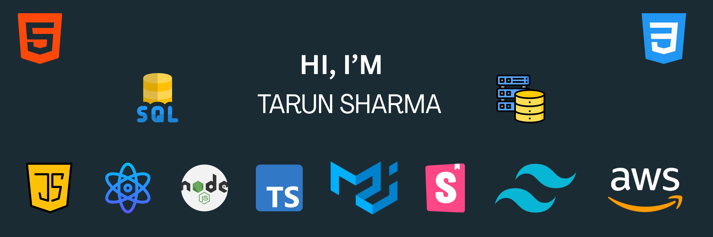

Hey there 👋

I’m Tarun, a senior full-stack engineer, creative coder and self-proclaimed designer who specializes in front-end development. I make it my mission to translate user-focused designs into pixel-perfect websites or applications that run blazing fast.

Want to know more about me? <a href="">Check out my portfolio</a>.

<h4> 📌 Pinned Repositories</h4>

 

<h4> 📌 Github Stats</h4>

